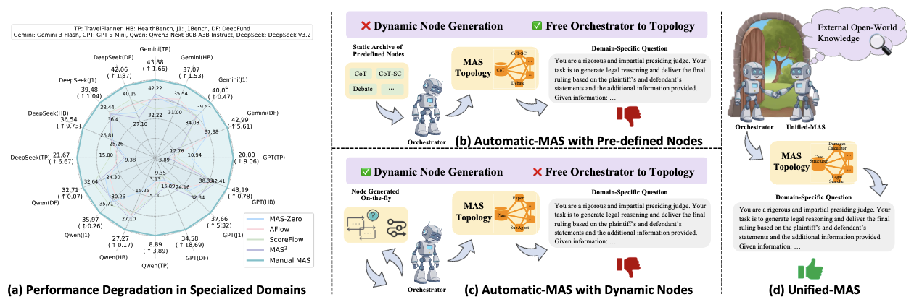
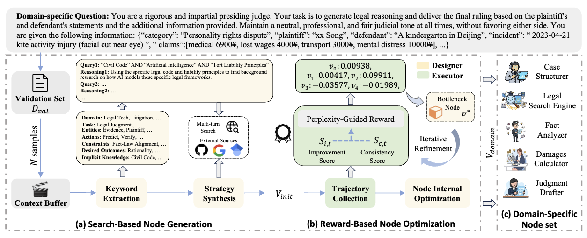

# 🚀 Unified-MAS

<div align="center">

### 🧠 Domain-specific Node Generation and Optimization


</div>

## 📄 Paper (arXiv)

> 🔗 **Link placeholder:** `[Coming Soon]`


---

<p align="center">
  
</p>

---

## ✨ What This Project Does

`Unified_MAS` provides a two-stage workflow:

1. 🔎 **Search Stage** (`run_search.py`)  
   - Infer task intent from dataset samples  
   - Build multi-strategy web search queries  
   - Fetch and analyze retrieved content  
   - Generate executable pipeline nodes (`generated_nodes.json`)

2. ⚙️ **Optimize Stage** (`run_optimize.py`)  
   - Execute generated nodes over dataset samples  
   - Collect per-node rewards  
   - Debug/fix failing nodes  
   - Iteratively optimize weakest nodes across epochs

---

## 🗂️ Key Files

- `run_search.py`: build search strategy and generate nodes
- `run_optimize.py`: run/optimize generated nodes with epoch loop
- `run.sh`: batch runner example
- `debug.py`: one-sample debug entry for pipeline tracing
- `intermediate_result/`: all generated artifacts (search, optimize, rounds)

---

<p align="center">
  
</p>

---

## 🧰 Environment Setup

### 1) Create and activate virtual environment

```bash
conda create -n unified_mas python=3.10 -y
conda activate unified_mas
python -m pip install --upgrade pip
```

### 2) Install dependencies

```bash
pip install openai requests beautifulsoup4 tqdm scholarly torch transformers
```

> 💡 If you already use a managed environment/conda, install the same packages there.

---

## 🔐 Required Environment Variables

Set API credentials before running:

```bash
export OPENAI_API_KEY="xx"
export OPENAI_API_BASE="xx"
export SERPER_API_KEY="xx"
export GITHUB_TOKEN="xx"
```

---

## ▶️ Quick Start

### Option A: Run all datasets with one script

```bash
bash run.sh
```

### Option B: Run step-by-step manually

#### Step 1 — Search + Node Generation

```bash
python run_search.py \
  --model gemini-3-pro-preview \
  --temperature 1 \
  --max_completion_tokens 32768 \
  --data_path xx/j1eval_validate.jsonl \
  --max_search_results 10 \
  --max_rounds 10 \
  --max_concurrent 50
```

#### Step 2 — Pipeline Execution + Optimization

```bash
python run_optimize.py \
  --nodes_json xx/j1eval/search/generated_nodes.json \
  --input_data xx/j1eval_validate.jsonl \
  --meta_model gemini-3-pro-preview \
  --executor_model qwen3-next-80b-a3b-instruct \
  --temperature 1 \
  --max_completion_tokens 32768 \
  --dataset_name j1eval \
  --max_search_results 10 \
  --max_rounds 1 \
  --max_debug_attempts 3 \
  --num_epochs 10 \
  --max_workers 50
```

---

## 🧪 Supported Dataset Names

Use one of:

- `j1eval`
- `travelplanner`
- `healthbench`
- `deepfund`
- `aime`

---

## 📦 Output Structure

Generated outputs are written under:

```text
intermediate_result/<dataset>/
├── search/
│   ├── task_keywords.txt
│   ├── search_queries.txt
│   ├── multi_turn_search_log.jsonl
│   ├── strategy_analysis.json
│   └── generated_nodes.json
└── optimize/
    ├── validate_results_epoch_*.jsonl
    └── rounds/
        └── epoch_*_generated_nodes.json
```

---

## 🩺 Debug One Sample Quickly

Use `debug.py` to run a first-sample dry run and print node I/O:

```bash
python debug.py \
  --nodes_json xx/deepfund/search/generated_nodes.json \
  --dataset_name deepfund \
  --input_data xx/deepfund_validate.jsonl
```

---

## 🧠 Practical Tips

- `--max_concurrent` and `--max_workers` can heavily impact speed and API pressure.
- First run can be expensive; start with fewer samples and fewer epochs.
- To do a quick validation, use `--samples_per_epoch` in `run_optimize.py`.
- Optimization supports resume mode via saved `rounds/` checkpoints.

---


<div align="center">

### 🌟 If this helps your workflow, keep iterating with small datasets first.

</div>

