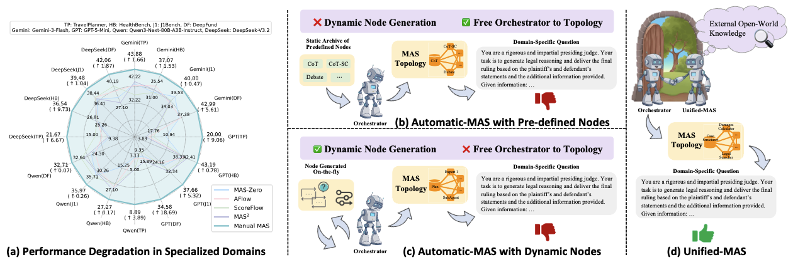
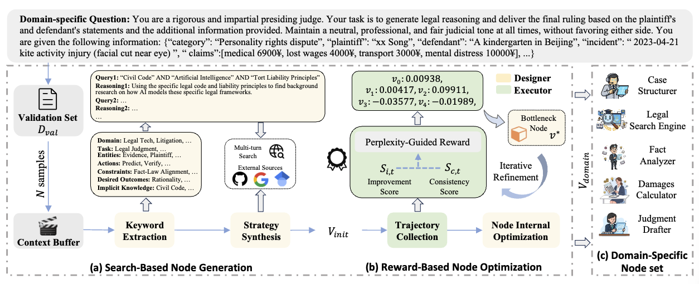

# 🚀 EMNLP 2026 Unified-MAS: Universally Generating Domain-Specific Nodes for Empowering Automatic Multi-Agent Systems.


<div align="center">

### 🧠 Domain-specific Node Generation and Optimization

[](https://arxiv.org/abs/2603.21475)
[](https://github.com/linhh29/Unified-MAS)
[](https://linhh29.github.io/blog/Unified-MAS/index.html)
[](https://unified-mas-demo.hehailin.life/)

</div>

---

## 🥳 News

- **[2026-06-03]** We add **demo inference** entry. Try your custom question with `bash run_demo_inference.sh`.
- **[2026-03-26]** We release **code** and **paper**: [Unified-MAS: Universally Generating Domain-Specific Nodes for Empowering Automatic Multi-Agent Systems.](https://arxiv.org/abs/2603.21475)


---

## Table of Contents

- [1. Overview](#1-overview)
- [2. Setup](#2-setup)
- [3. Demo Inference (Custom Question)](#3-demo-inference-custom-question)
- [4. Full Pipeline (Paper Benchmarks)](#4-full-pipeline-paper-benchmarks)
- [5. Tips](#5-tips)

---

## 1. Overview

<p align="center">
  
</p>

---

### What This Project Does

`Unified-MAS` provides a two-stage workflow:

1. 🔎 **Search Stage** (`run_search.py`)  
   - Infer task intent from dataset samples  
   - Build multi-strategy web search queries  
   - Fetch and analyze retrieved content  
   - Generate executable pipeline nodes (`generated_nodes.json`)

2. ⚙️ **Optimize Stage** (`run_optimize.py`)  
   - Execute generated nodes over dataset samples  
   - Collect per-node rewards  
   - Debug/fix failing nodes  
   - Iteratively optimize weakest nodes across epochs

For a **quick try on your own question** (search only, no optimize), use **`demo_inference.py`** — see [Section 3](#3-demo-inference-custom-question).  
To reproduce the **full search + optimize pipeline** on paper benchmarks, see [Section 4](#4-full-pipeline-paper-benchmarks).

---

### Key Files

| File | Description |
|------|-------------|
| `demo_inference.py` | Search-only demo: custom question → generated nodes |
| `run_demo_inference.sh` | Shell launcher for demo inference (question + model) |
| `run_search.py` | Full search stage on a benchmark dataset |
| `run_optimize.py` | Execute and optimize generated nodes |
| `run.sh` | Batch runner (search + optimize for all datasets) |
| `debug.py` | One-sample debug entry for pipeline tracing |
| `intermediate_result/` | All generated artifacts (search, optimize, rounds) |

---

<p align="center">
  
</p>

---

## 2. Setup

### Environment

```bash
conda create -n unified_mas python=3.10 -y
conda activate unified_mas
python -m pip install --upgrade pip
pip install openai requests beautifulsoup4 tqdm scholarly torch transformers
```

> 💡 If you already use a managed environment/conda, install the same packages there.

### Required Environment Variables

Set API credentials before running:

```bash
export OPENAI_API_KEY="xx"
export OPENAI_API_BASE="xx"
export SERPER_API_KEY="xx"
export GITHUB_TOKEN="xx"
```

---

## 3. Demo Inference (Custom Question)

Use this when you want to try Unified-MAS on **your own task** without a benchmark dataset or the optimize stage.

Only two inputs are required: **question** and **model name**. Other hyperparameters are defined at the top of `demo_inference.py` (`TEMPERATURE`, `MAX_SEARCH_RESULTS`, etc.).

**Option A — shell script (recommended)**

```bash
bash run_demo_inference.sh \
  "Design a multi-agent pipeline to analyze legal contracts and extract key obligations." \
  gemini-3-pro-preview
```

**Option B — Python directly**

```bash
python demo_inference.py \
  --question "Design a multi-agent pipeline to analyze legal contracts and extract key obligations." \
  --model gemini-3-pro-preview
```

**What it does**

1. Extracts task keywords from your question  
2. Runs multi-strategy web search (Google, Scholar, GitHub)  
3. Analyzes retrieved content  
4. Generates pipeline nodes → `intermediate_result/demo/custom/search/generated_nodes.json`

**Output layout**

```text
intermediate_result/demo/custom/search/
├── custom_question.txt
├── task_keywords.txt
├── search_queries.txt
├── multi_turn_search_log.jsonl
├── fetched_contents.json
├── strategy_analysis.json
└── generated_nodes.json
```

---

## 4. Full Pipeline (Paper Benchmarks)

This section covers the **search + optimize** workflow used in the paper on benchmark datasets.

### Supported Dataset Names

Use one of:

- `j1eval`
- `travelplanner`
- `healthbench`
- `deepfund`
- `aime`

Prepare the corresponding validation JSONL files (e.g. `xx/j1eval_validate.jsonl`) and pass them to `run_search.py` / `run_optimize.py`.

### Run all datasets with one script

```bash
bash run.sh
```

This runs search and optimize sequentially for all paper datasets configured in `run.sh`.

### Full pipeline — step by step

#### Step 1 — Search + Node Generation

```bash
python run_search.py \
  --model gemini-3-pro-preview \
  --temperature 1 \
  --max_completion_tokens 32768 \
  --data_path xx/j1eval_validate.jsonl \
  --max_search_results 10 \
  --max_rounds 10 \
  --max_concurrent 50
```

#### Step 2 — Pipeline Execution + Optimization

```bash
python run_optimize.py \
  --nodes_json xx/j1eval/search/generated_nodes.json \
  --input_data xx/j1eval_validate.jsonl \
  --meta_model gemini-3-pro-preview \
  --executor_model qwen3-next-80b-a3b-instruct \
  --temperature 1 \
  --max_completion_tokens 32768 \
  --dataset_name j1eval \
  --max_search_results 10 \
  --max_rounds 1 \
  --max_debug_attempts 3 \
  --num_epochs 10 \
  --max_workers 50
```

### Output structure

Generated outputs are written under:

```text
intermediate_result/<dataset>/
├── search/
│   ├── task_keywords.txt
│   ├── search_queries.txt
│   ├── multi_turn_search_log.jsonl
│   ├── strategy_analysis.json
│   └── generated_nodes.json
└── optimize/
    ├── validate_results_epoch_*.jsonl
    └── rounds/
        └── epoch_*_generated_nodes.json
```

---

## 5. Tips

### Debug One Sample Quickly

Use `debug.py` to run a first-sample dry run and print node I/O:

```bash
python debug.py \
  --nodes_json xx/deepfund/search/generated_nodes.json \
  --dataset_name deepfund \
  --input_data xx/deepfund_validate.jsonl
```

---

### Practical Tips

- `--max_concurrent` and `--max_workers` can heavily impact speed and API pressure.
- First run can be expensive; start with fewer samples and fewer epochs.
- For demo inference, use a focused `--question`; tune search behavior by editing constants in `demo_inference.py`.
- Cached files under `intermediate_result/` are reused by default; set `FORCE_RERUN = True` in `demo_inference.py` to refresh.
- To do a quick validation on benchmarks, use `--samples_per_epoch` in `run_optimize.py`.
- Optimization supports resume mode via saved `rounds/` checkpoints.

---

### 🌟 If you find this project helpful, please consider giving us a star and citing our paper — we'd really appreciate it!

```bibtex
@article{lin2026unified,
  title={Unified-MAS: Universally Generating Domain-Specific Nodes for Empowering Automatic Multi-Agent Systems},
  author={Lin, Hehai and Yan, Yu and Wang, Zixuan and Xu, Bo and Wang, Sudong and Huang, Weiquan and Zhao, Ruochen and Li, Minzhi and Qin, Chengwei},
  journal={arXiv preprint arXiv:2603.21475},
  year={2026}
}
```
